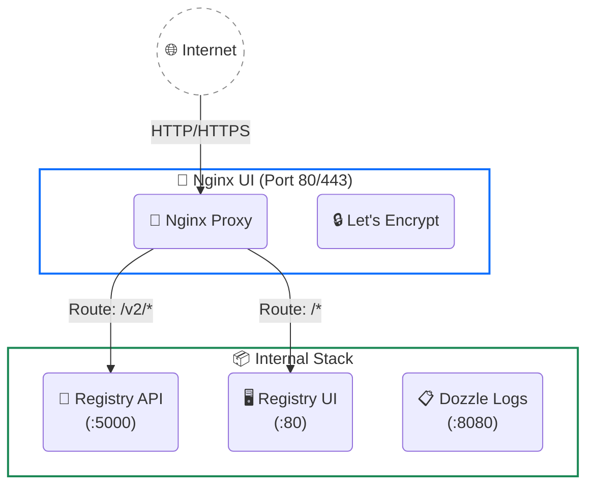

# 🚀 Hướng dẫn Triển khai & Vận hành (Deployment & Operations)

Tài liệu này cung cấp hướng dẫn chi tiết về kiến trúc, cách cài đặt thủ công, cấu hình Tên miền (Reverse Proxy) và các quy trình bảo trì hệ thống **LaunchPad Registry Stack**.

---

## 🏗️ Sơ đồ Kiến trúc



---

## 🛠️ Triển khai Thủ công (Manual Setup)

Nếu bạn không sử dụng script `install.sh` tự động, hãy làm theo các bước sau:

### Bước 1: Quản lý Tài khoản (Authentication)
Registry sử dụng `htpasswd` để bảo vệ API. Thay vì cài các phần mềm mã hóa phức tạp lên VPS, hãy dùng Bash Script đi kèm (sử dụng chính Docker để tạo mã băm Bcrypt an toàn):

```bash
# Cấp quyền thực thi cho script
chmod +x scripts/manage-auth.sh

# Tạo tài khoản Admin mới
./scripts/manage-auth.sh add admin <MẬT_KHẨU_CỦA_BẠN>
```
*(Lệnh này cũng dùng để đổi mật khẩu. Để xem danh sách chạy `list`, để xóa chạy `delete`).*

### Bước 2: Khởi chạy Hệ thống
Đảm bảo VPS của bạn không có Nginx hay Apache nào đang chạy và chiếm port `80`.
```bash
docker compose up -d
```

### Bước 3: Hoàn tất Nginx UI Web Setup
Sau khi chạy lên, Nginx UI sẽ khóa bảng điều khiển. Để truy cập, bạn cần một đoạn mã khóa (Install Secret):

```bash
# Lấy mã Install Secret từ container
docker exec registry-nginx-ui cat /etc/nginx-ui/.install_secret
```

1. Mở trình duyệt, truy cập `http://<IP_VPS>`.
2. Dán đoạn mã **Install Secret** vừa lấy được.
3. Đăng ký tài khoản Admin cho bảng quản trị Nginx UI.
4. *(Khuyến nghị)* Vào **Settings → Authentication** để bật 2FA (Bảo mật 2 lớp).

> **💡 Xử lý sự cố Nginx UI:** Nếu truy cập IP mà thấy trang "Welcome to nginx!" thay vì Nginx UI, hãy chạy:
> ```bash
> rm -f ./nginx-ui/nginx/conf.d/default.conf
> docker compose restart nginx-ui
> ```

---

## 🌐 Cấu hình Tên miền (Reverse Proxy) & HTTPS

Trong bảng điều khiển Nginx UI, tạo một trang web mới (**Sites** -> **Add Site**):

1. **Server Name**: `hub.yourdomain.com` (Đảm bảo đã trỏ DNS về IP VPS).
2. **Listen**: `80`.
3. Trong phần **Locations**, tạo 2 block cấu hình:

   **Block 1: API của Docker Registry**
   - **Path**: `/v2/`
   - **Proxy Pass**: `http://docker-registry:5000`
   - **Host**: `$http_host` *(Quan trọng: Gõ tay `$http_host` vào ô, KHÔNG tích "Preserve Host")*.
   - Bật các Header: `X-Real-IP`, `X-Forwarded-For`, `X-Forwarded-Proto`.
   - Nâng `proxy_read_timeout` lên `900`.
   - Thêm đoạn cấu hình nâng cao vào mục Config của cấp Server: `client_max_body_size 0; chunked_transfer_encoding on;` (Để bỏ giới hạn dung lượng file tải lên).

   **Block 2: Giao diện Registry UI**
   - **Path**: `/`
   - **Proxy Pass**: `http://registry-ui:80`
   - Bật các tùy chọn Header tương tự Block 1.

4. **Bật SSL (HTTPS):**
   - Chuyển sang Tab **SSL** -> Bật **Enable SSL** -> Chọn **Let's Encrypt** -> Điền Email -> Nhấn **Issue**.
   - *(Lưu ý: Nếu bạn đang sử dụng proxy đám mây màu cam của Cloudflare, bạn có thể thiết lập SSL linh hoạt trực tiếp trên Cloudflare và bỏ qua bước Let's Encrypt này để tiết kiệm tài nguyên).*

---

## 📈 Vận hành & Bảo trì (Operations & Maintenance)

### 1. Dọn dẹp Rác định kỳ (Garbage Collection)
Khi bạn push đè các phiên bản Image (`latest`), ổ cứng dần dần sẽ bị đầy bởi các data block mồ côi. Để giải phóng dung lượng:

```bash
chmod +x scripts/clean-registry.sh
./scripts/clean-registry.sh
```
*(Script này sẽ gọi lệnh `garbage-collect` bên trong container Registry để quét và xóa sạch rác một cách an toàn).*

### 2. Xem Log Hệ Thống Bảo Mật (Dozzle)
Hệ thống đi kèm **Dozzle** - ứng dụng giám sát log siêu nhẹ (~5MB RAM). Để xem log qua trình duyệt web một cách an toàn (được bảo vệ bằng mật khẩu và SSL thông qua Nginx UI):

1. Trong **Nginx UI**, tạo một **Site (Reverse Proxy)** cho subdomain riêng (ví dụ: `logs.yourdomain.com`).
2. Trỏ **Proxy Pass** về: `http://dozzle:8080` (Duy trì giao tiếp kín trong mạng nội bộ Docker, tuyệt đối không lộ cổng ra ngoài Internet).
3. Bật **Basic Auth (Mật khẩu bảo vệ)** trỏ tới đường dẫn file password bên trong container Nginx UI: `/etc/nginx/registry.password` (file mật khẩu này đã được script cài đặt tự động đồng bộ).
4. Kích hoạt WebSockets (`Upgrade`, `Connection "Upgrade"`) và nâng cấu hình timeout đọc `proxy_read_timeout` lên `900s` để stream log thời gian thực mượt mà mà không bị đứt kết nối.

### 3. Tự động cập nhật (Watchtower)
Watchtower hoạt động ngầm vào lúc 4:00 AM mỗi ngày. Nó sẽ kiểm tra phiên bản mới của các hạ tầng như Nginx UI, Dozzle. Nếu có bản vá lỗi, nó sẽ tự động tải về và khởi động lại mà không gây gián đoạn (Zero-Downtime update).
*(Lưu ý: Nó chỉ tự cập nhật hạ tầng có gắn nhãn, không đụng tới các ứng dụng riêng của bạn).*

### 4. Cấu hình Tường lửa (Firewall)
Theo chuẩn bảo mật, bạn chỉ cần mở Port `80` và `443` cho VPS. Các port nội bộ như `5000`, `8080` chỉ giao tiếp kín trong mạng ảo Docker, tuyệt đối không mở ra Public.
