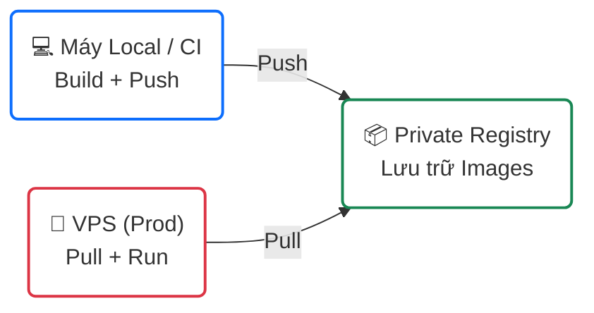

# 🚀 Hướng dẫn Triển khai (Tối ưu cho VPS tài nguyên thấp)

Quy trình này được tối ưu cho **Tech Lead** triển khai trên VPS có CPU/RAM hạn chế. Chiến lược: **Build tại máy local → Push lên Registry → Pull trên VPS**.

---

## 🏗️ Kiến trúc triển khai



---

## 📦 Phần 1: Cài đặt Private Registry

Thực hiện trên VPS hoặc server lưu trữ riêng.

### Bước 1.1: Clone dự án

```bash
git clone https://github.com/tuquet/launchpad-registry-stack.git
cd launchpad-registry-stack
```

### Bước 1.2: Tạo file xác thực

> 📄 Chi tiết: [docs/docker-registry.md](./docs/docker-registry.md#authentication-htpasswd)

```bash
mkdir -p auth
docker run --rm --entrypoint htpasswd httpd:2.4 -Bbn admin <MẬT_KHẨU_MẠNH> > auth/registry.password
```

### Bước 1.3: Cấu hình Firewall

> 📄 Chi tiết: [docs/firewall-ufw.md](./docs/firewall-ufw.md)

```bash
chmod +x scripts/setup-ufw.sh

# Chọn 1 trong 2:
./scripts/setup-ufw.sh http    # Không có domain
./scripts/setup-ufw.sh https   # Có domain
```

### Bước 1.4: Khởi chạy Registry

**🔓 Không có domain (HTTP):**

```bash
docker compose up -d
```

**🔒 Có domain (HTTPS — Nginx UI):**

> 📄 Chi tiết: [docs/nginx-ui.md](./docs/nginx-ui.md)

```bash
# 1. Khởi chạy stack
docker compose -f docker-compose.ssl.yml up -d

# 2. Lấy Install Secret
docker exec registry-nginx-ui cat /etc/nginx-ui/.install_secret

# 3. Hoàn tất Web Setup
#    → Truy cập http://<IP_VPS>:80
#    → Nhập Install Secret
#    → Tạo admin account + Bật 2FA

# 4. Trong Nginx UI: tạo site config cho Registry
#    → Xem mẫu config tại docs/nginx-ui.md

# 5. Bật SSL One-click
#    → Trong site config → Enable SSL → Let's Encrypt → Issue
```

**Kiểm tra:**

```bash
# HTTP
curl -u admin:<PASS> http://localhost:5000/v2/_catalog

# HTTPS
curl -u admin:<PASS> https://hub.example.com/v2/_catalog
```

---

## 🛠️ Phần 2: Build và Push (Máy Local / CI)

> **⚠️ Luôn thực hiện trên máy mạnh, KHÔNG build trên VPS.**

### Bước 2.1: Đăng nhập

```bash
# HTTP
docker login <IP_REGISTRY>:5000

# HTTPS
docker login hub.example.com
```

> **⚠️ HTTP mode:** Cần `insecure-registries`. Xem [docs/docker-registry.md](./docs/docker-registry.md#đăng-nhập).

### Bước 2.2: Build và push

```bash
# Build
docker build -t <REGISTRY>/strapi-app:v1 ./strapi
docker build -t <REGISTRY>/next-app:v1 ./next

# Push
docker push <REGISTRY>/strapi-app:v1
docker push <REGISTRY>/next-app:v1
```

---

## 🚀 Phần 3: Pull và Deploy trên VPS

### Bước 3.1: Tạo docker-compose.prod.yml

```yaml
services:
  strapi:
    image: <REGISTRY>/strapi-app:v1
    restart: always
    ports:
      - "1337:1337"
    env_file:
      - .env

  nextjs:
    image: <REGISTRY>/next-app:v1
    restart: always
    ports:
      - "3000:3000"
    env_file:
      - .env
```

### Bước 3.2: Deploy

```bash
docker login <REGISTRY>
docker compose -f docker-compose.prod.yml up -d
```

### Bước 3.3: Cập nhật phiên bản

```bash
# Local: build + push v2
docker build -t <REGISTRY>/strapi-app:v2 ./strapi
docker push <REGISTRY>/strapi-app:v2

# VPS: cập nhật tag + redeploy
docker compose -f docker-compose.prod.yml pull
docker compose -f docker-compose.prod.yml up -d
```

---

## 💡 Mẹo cho VPS RAM thấp (1GB - 2GB)

| Vấn đề | Giải pháp |
|:--------|:----------|
| VPS treo khi build | **KHÔNG** chạy `docker compose up --build` trên VPS |
| Dung lượng đĩa đầy | Chạy [Garbage Collection](./docs/docker-registry.md#garbage-collection-dọn-rác) |
| Docker login lỗi | Cấu hình `insecure-registries` hoặc bật SSL trong Nginx UI |
| Cần HTTPS | Dùng [Nginx UI](./docs/nginx-ui.md) — One-click Let's Encrypt |
| Nginx config sai | Dùng Nginx UI config backup → rollback |
| Server monitoring | Nginx UI dashboard → CPU, RAM, Disk real-time |

---

## 📈 Tóm tắt vòng đời

```text
1. Code (Local)  →  2. Build (Local)  →  3. Push (Registry)
                                                ↓
5. Run (VPS)     ←  4. Pull (VPS)     ←────────┘
```

**Nguyên tắc vàng:** VPS chỉ làm 2 việc — **Pull** và **Run**.
