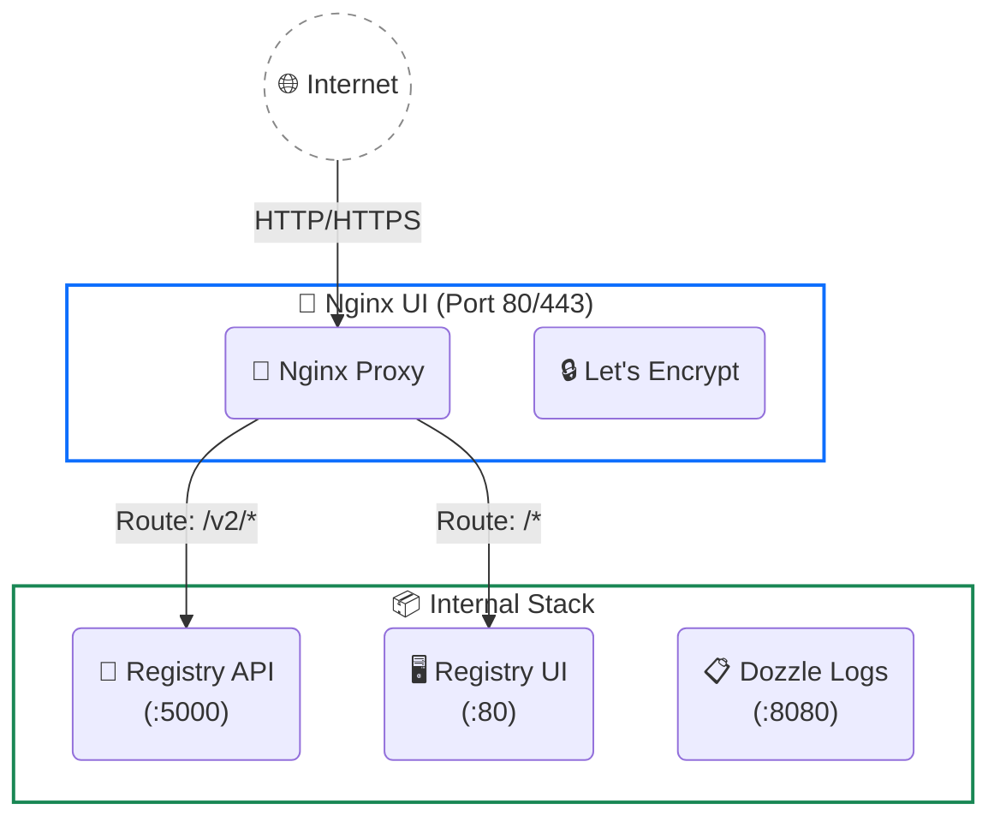

# 🚀 LaunchPad Registry Stack

[](https://www.docker.com/)
[](https://nginx.org/en/)

**LaunchPad Registry Stack** là một hệ sinh thái mã nguồn mở độc lập, cung cấp giải pháp lưu trữ Private Docker Registry trên VPS kết hợp với giao diện quản trị Web hiện đại. 

Tôi xây dựng kho lưu trữ này với mục tiêu giải phóng các nhà phát triển khỏi những dòng lệnh bảo trì máy chủ nhàm chán. Bằng cách tích hợp các công cụ mạnh mẽ nhất như **Nginx UI** (Cấp phát SSL tự động), **Dozzle** (Xem log real-time), và **Watchtower** (Tự động cập nhật), bạn có thể vận hành một Registry cấp doanh nghiệp chỉ với chưa đầy 1GB RAM.

---

## ✨ Tính năng nổi bật

- 🐳 **Private Registry**: Lưu trữ Docker Image an toàn và bảo mật hoàn toàn nội bộ.
- 🔀 **Nginx UI**: Giao diện Web quản lý Nginx, tự động cấp phát và gia hạn chứng chỉ HTTPS/SSL (Let's Encrypt) bằng một click.
- 🔐 **Bảo mật Zero-Dependency**: Script quản lý tài khoản tự động dùng `Bcrypt` thông qua Docker container, không yêu cầu cài đặt phần mềm phụ trợ (như `apache2-utils`) trên VPS.
- 📜 **Log Viewer**: Tích hợp Dozzle để theo dõi log của các container trực tiếp qua trình duyệt với mức tiêu thụ RAM siêu nhỏ (~5MB).
- 🔄 **Auto Updates**: Tự động giám sát và cập nhật phiên bản vá lỗi của các Docker Image đang chạy.

---

## 🏗️ Sơ đồ Kiến trúc



---

## 🚀 Triển khai Nhanh (Automated Installation)

Nếu VPS của bạn mới tinh (Ubuntu/Debian), tôi đã chuẩn bị sẵn một script tự động cài đặt từ A-Z (Docker, Firewall, Auth, khởi chạy Stack):

```bash
# Clone kho lưu trữ
git clone https://github.com/tuquet/launchpad-registry-stack.git
cd launchpad-registry-stack

# Chạy script cài đặt tự động
chmod +x install.sh
./install.sh
```

---

## 🛠️ Triển khai Thủ công (Manual Setup)

Nếu bạn muốn tự kiểm soát quá trình cài đặt, hãy làm theo luồng (Workflow) thống nhất dưới đây:

### Bước 1: Quản lý Tài khoản (Authentication)

Registry sử dụng `htpasswd` để bảo vệ API. Thay vì cài các phần mềm mã hóa phức tạp lên VPS, hãy dùng Bash Script đi kèm:

```bash
# Phân quyền cho script
chmod +x scripts/manage-auth.sh

# Tạo tài khoản Admin mới (Script sẽ dùng container registry:2 để tạo mã băm Bcrypt an toàn)
./scripts/manage-auth.sh add admin <MẬT_KHẨU_CỦA_BẠN>
```
*(Bạn cũng có thể dùng lệnh này để đổi mật khẩu, hoặc chạy `./scripts/manage-auth.sh list` để xem, `delete` để xóa).*

### Bước 2: Khởi chạy Hệ thống

Đảm bảo VPS của bạn không có Nginx hay Apache nào đang chạy và chiếm port `80`.

```bash
docker compose up -d
```

### Bước 3: Hoàn tất Nginx UI Web Setup

Sau khi Stack chạy lên, **Nginx UI** sẽ chặn ngay cổng `80` để bảo vệ server. Để truy cập bảng điều khiển, bạn cần một đoạn mã khóa (Install Secret):

```bash
# Lấy mã Install Secret từ container
docker exec registry-nginx-ui cat /etc/nginx-ui/.install_secret
```

1. Mở trình duyệt, truy cập `http://<IP_VPS>`.
2. Dán đoạn mã **Install Secret** vừa lấy được (lưu ý không copy thừa khoảng trắng).
3. Đăng ký tài khoản Admin và mật khẩu cho bảng quản trị Nginx UI.
4. *(Khuyến nghị)* Vào **Settings → Authentication** để bật 2FA (Bảo mật 2 lớp).

> **💡 Xử lý sự cố:** Nếu bạn mở IP mà thấy trang "Welcome to nginx!" thay vì Nginx UI, nguyên nhân do thư mục `nginx/conf.d` bị lưu file cũ. Cách xử lý:
> ```bash
> rm -f ./nginx-ui/nginx/conf.d/default.conf
> docker compose restart nginx-ui
> ```
> Nếu quên mật khẩu Web UI: `docker exec -it registry-nginx-ui nginx-ui reset-password`

### Bước 4: Cấu hình Tên miền (Reverse Proxy) & HTTPS

Trong bảng điều khiển Nginx UI, hãy tạo một trang web mới:

1. Vào **Sites** -> **Add Site**.
2. **Server Name**: `hub.yourdomain.com` (Đổi thành domain của bạn, đảm bảo đã trỏ DNS về IP).
3. **Listen**: `80`.
4. Trong phần **Locations**, tạo 2 block cấu hình:

   **Block 1: API của Docker Registry**
   - **Path**: `/v2/`
   - **Proxy Pass**: `http://docker-registry:5000`
   - **Host**: `$http_host` (Quan trọng: Không được tích "Preserve Host" mà phải tự gõ vào ô Host là `$http_host`).
   - Bật các Header: `X-Real-IP`, `X-Forwarded-For`, `X-Forwarded-Proto`.
   - Nâng `proxy_read_timeout` lên `900`.
   - Tắt giới hạn dung lượng: Thêm đoạn cấu hình nâng cao `client_max_body_size 0; chunked_transfer_encoding on;` ở cấp độ Server.

   **Block 2: Giao diện Registry UI**
   - **Path**: `/`
   - **Proxy Pass**: `http://registry-ui:80`
   - Bật các tùy chọn Header tương tự Block 1.

5. **Bật SSL Tự động**:
   - Chuyển sang Tab **SSL** -> Bật **Enable SSL** -> Chọn **Let's Encrypt** -> Điền Email -> Nhấn **Issue**.
   - Chứng chỉ HTTPS sẽ được cấp phát và hệ thống sẽ tự động cấu hình lại Nginx ngay tắp lự.

---

## 📈 Vận hành & Bảo trì (Operations & Maintenance)

### 1. Dọn dẹp Rác định kỳ (Garbage Collection)
Khi bạn thường xuyên đẩy (push) Image lên Registry, hoặc thay thế Image cũ cùng một tag (`latest`), Docker Registry vẫn lưu giữ những "tảng băng chìm" (các data block không còn được sử dụng) khiến ổ cứng bị đầy. Để dọn dẹp không gian lưu trữ:

```bash
# Cấp quyền và chạy Script tôi đã chuẩn bị sẵn
chmod +x scripts/clean-registry.sh
./scripts/clean-registry.sh
```
*(Script này sẽ an toàn quét qua ổ đĩa và gọi lệnh `garbage-collect` bên trong container Registry để giải phóng dung lượng).*

### 2. Tự động cập nhật (Watchtower)
Thay vì phải thỉnh thoảng nhớ gõ lệnh update các phần mềm hạ tầng (Nginx UI, Dozzle, v.v.), **Watchtower** làm việc đó một cách hoàn toàn tự động!
- **Hoạt động ngầm:** Mỗi ngày vào lúc 4:00 AM sáng, Watchtower sẽ tự động kiểm tra trên Docker Hub xem có bản vá lỗi (patch) nào mới cho các phần mềm này không.
- **Tự động tải và thay thế:** Nếu có, nó sẽ âm thầm tải về, tắt container cũ và khởi động lại với cấu hình y nguyên (Zero-Downtime update).
- **Phạm vi an toàn:** Nó chỉ quét những container nào có gắn nhãn `com.centurylinklabs.watchtower.enable=true` (nghĩa là nó chỉ tự cập nhật hệ sinh thái hạ tầng DevOps này, KHÔNG BAO GIỜ chạm vào các ứng dụng/source code của bạn chạy trên VPS).

### 3. Xem Log Container (Dozzle)
Dozzle là một ứng dụng "nhẹ tựa lông hồng" (tiêu tốn ~5MB RAM). 
- Thay vì phải gõ lệnh `docker logs -f` rườm rà, bạn có thể thiết lập Nginx UI tạo một Proxy Pass trỏ cổng `8080` của Dozzle ra một đường dẫn đặc biệt (VD: `hub.yourdomain.com/logs`). 
- Giao diện của Dozzle cho phép bạn theo dõi theo thời gian thực (real-time) và tìm kiếm chữ trong log của toàn bộ hệ thống cực kỳ nhanh chóng.

### 4. Cấu hình Tường lửa (Firewall)
Hệ thống này được thiết kế theo tiêu chuẩn đóng kín. Bạn chỉ cần mở duy nhất Port `80` và `443` cho VPS. Toàn bộ các cổng nội bộ khác (`5000`, `5001`, `8080`) đã được cô lập an toàn trong mạng ảo của Docker.

---

*Phát triển độc lập. Xây dựng cho tốc độ và sự đơn giản.*
