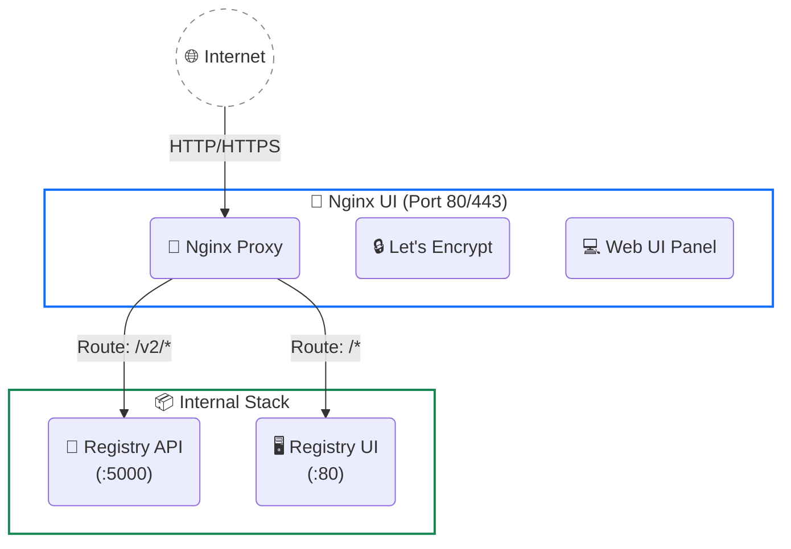

# 🔀 Nginx UI — Quản trị Nginx + SSL

> Module quản trị Nginx Reverse Proxy và SSL Certificate trong hệ sinh thái LaunchPad DevOps.
> Thay thế cấu hình thủ công Nginx + Certbot bằng giao diện web hiện đại.

---

## Tổng quan

**Nginx UI** là giải pháp quản trị Nginx và SSL Certificate all-in-one thông qua giao diện web hiện đại.

| Tính năng chính | Mô tả |
|:----------|:----------------|
| Nginx Config | Cấu hình qua GUI Block Editor hoặc Ace Code Editor có syntax highlighting |
| SSL Certificate | Tích hợp Let's Encrypt, cấp phát 1 click và tự động gia hạn |
| Config Backup | Tự động backup, so sánh (diff) và rollback cấu hình |
| Server Monitoring | Theo dõi CPU, RAM, Disk, Load average theo thời gian thực |
| Log Viewer | Xem Access Log và Error Log trực tiếp trên web |
| Tự động Reload | Tự động test file config và reload Nginx sau khi lưu |
| Web Terminal | Tích hợp SSH Terminal ngay trong trình duyệt |

> **📦 Docker Image:** `uozi/nginx-ui:latest` — đã bao gồm Nginx bên trong. Distribute dưới dạng single container.

---

## Kiến trúc



---

## Setup lần đầu

### Bước 1: Khởi chạy stack

```bash
# Tạo auth cho Registry
mkdir -p auth
docker run --rm --entrypoint htpasswd httpd:2.4 -Bbn admin <MẬT_KHẨU> > auth/registry.password

# Khởi chạy
docker compose -f docker-compose.ssl.yml up -d
```

### Bước 2: Lấy Install Secret

```bash
# Đọc install secret từ container
docker exec registry-nginx-ui cat /etc/nginx-ui/.install_secret
```

### Bước 3: Hoàn tất Web Setup

1. Truy cập `http://<IP_VPS>:80`
2. Nhập **Install Secret** từ bước 2
3. Tạo tài khoản admin cho Nginx UI
4. **Bật 2FA** ngay sau khi đăng nhập (Settings → Authentication)

### Bước 4: Cấu hình Reverse Proxy cho Registry

Trong Nginx UI, tạo site config mới với nội dung:

```nginx
upstream docker-registry {
    server registry:5000;
}

upstream registry-ui {
    server registry-ui:80;
}

server {
    listen 80;
    server_name hub.example.com;    # ← Thay bằng domain thực tế

    # Docker Registry API
    client_max_body_size 0;
    chunked_transfer_encoding on;

    location /v2/ {
        proxy_pass http://docker-registry;
        proxy_set_header Host $http_host;
        proxy_set_header X-Real-IP $remote_addr;
        proxy_set_header X-Forwarded-For $proxy_add_x_forwarded_for;
        proxy_set_header X-Forwarded-Proto $scheme;
        proxy_read_timeout 900;
    }

    # Registry UI
    location / {
        proxy_pass http://registry-ui;
        proxy_set_header Host $http_host;
        proxy_set_header X-Real-IP $remote_addr;
        proxy_set_header X-Forwarded-For $proxy_add_x_forwarded_for;
        proxy_set_header X-Forwarded-Proto $scheme;
    }
}
```

### Bước 5: Đăng ký SSL Certificate (Let's Encrypt)

Để sử dụng HTTPS, bạn cần cấp phát SSL Certificate. Đảm bảo **Domain đã trỏ về IP của VPS** và **port 80/443 đã được mở** trên Firewall.

**Cách 1: Issue SSL thông qua Site Config (Khuyến nghị)**
1. Mở Nginx UI, vào mục **Manage Sites**.
2. Chọn Site Config của Registry (vừa tạo ở bước 4).
3. Chuyển sang tab **Certificate**.
4. Chọn tuỳ chọn **Let's Encrypt** (hoặc nhấn nút "Issue Certificate").
5. Nhập các thông tin cần thiết:
   - **Domain:** `hub.example.com` (Sẽ tự động điền theo server_name)
   - **Email:** Nhập email của bạn (Ví dụ: `admin@example.com`)
   - **Challenge Method:** Để mặc định là `HTTP-01` (Nginx UI sẽ tự lo phần cấu hình route `.well-known`).
6. Nhấn **Issue** và đợi khoảng 15-30 giây.
7. Sau khi cấp phát thành công, Nginx UI sẽ tự động cấu hình đường dẫn tới cert/key và tự động tạo rule redirect HTTP sang HTTPS.
8. Bật toggle **Enable SSL** và nhấn **Save** cấu hình.

**Cách 2: Issue SSL độc lập qua menu Certificates**
1. Mở sidebar, chọn mục **Certificates**.
2. Nhấn nút **Add Certificate**.
3. Chọn Provider là **Let's Encrypt**.
4. Nhập Domain và Email tương tự cách 1.
5. Nhấn **Save / Issue**. Nginx UI sẽ lấy chứng chỉ về máy.
6. Sau đó, quay lại phần **Manage Sites**, mở config của bạn và chọn chứng chỉ vừa tạo từ dropdown list ở mục SSL.

> **✅ Xong!** Chứng chỉ Let's Encrypt sẽ tự động được Nginx UI theo dõi và gia hạn (renew) khi sắp hết hạn (thường là trước 30 ngày). Bạn không cần cấu hình thêm cronjob.

---

## Tính năng chính

### 📊 Server Monitoring

Dashboard real-time hiển thị:
- CPU Usage (%)
- Memory Usage (%)
- Load Average (1m, 5m, 15m)
- Disk Usage (%)

### 💾 Config Backup & Versioning

- Tự động backup **mỗi lần save** config
- Xem diff giữa 2 phiên bản bất kỳ
- **One-click rollback** về version trước

### 📜 Online Log Viewer

- Xem access log và error log real-time
- Không cần SSH

### 💻 Web Terminal

- Terminal trực tiếp trong browser
- Hỗ trợ các lệnh quản trị nhanh

### 🤖 AI Assistant

- Tích hợp ChatGPT / Deepseek
- Hỗ trợ tối ưu Nginx config
- Code completion trong editor

### 🔐 Security

- **2FA Authentication** cho Nginx UI panel
- Webauthn support
- Casdoor SSO integration (tuỳ chọn)

### 🔄 Cluster Management (Nâng cao)

- Mirror config tới nhiều VPS node
- Quản lý multi-server từ 1 panel

---

## Performance Tuning

Thêm các cấu hình sau trong Nginx UI editor khi cần:

```nginx
# ─── Trong block http {} hoặc server {} ───

# Gzip compression
gzip on;
gzip_vary on;
gzip_min_length 1000;
gzip_types application/json text/plain application/xml;

# Connection tuning
keepalive_timeout 65;
send_timeout 300;

# Buffer cho proxy
proxy_buffer_size 128k;
proxy_buffers 4 256k;
proxy_busy_buffers_size 256k;

# Proxy timeouts (quan trọng cho large image push)
proxy_connect_timeout 300;
proxy_send_timeout 300;
proxy_read_timeout 900;
```

---

## Headers quan trọng

| Header | Giá trị | Mục đích |
|:-------|:--------|:---------|
| `Host` | `$http_host` | Giữ nguyên hostname gốc, cần cho Registry auth |
| `X-Real-IP` | `$remote_addr` | IP thật của client (dùng cho logging) |
| `X-Forwarded-For` | `$proxy_add_x_forwarded_for` | Chuỗi IP qua các proxy |
| `X-Forwarded-Proto` | `$scheme` | HTTP hay HTTPS (Registry cần biết để tạo đúng URL) |

> **⚠️ Quan trọng:** Thiếu header `Host` sẽ khiến Registry trả về URL sai trong response, gây lỗi khi `docker push/pull`.

---

## Volume Structure

```text
nginx-ui/
├── nginx/                 ← Nginx config (persistent, gitignored)
│   ├── nginx.conf         ← Main config (auto-generated)
│   ├── sites-available/   ← Site configs
│   └── sites-enabled/     ← Active sites (symlinks)
├── data/                  ← Nginx UI data (persistent, gitignored)
│   ├── app.ini            ← Nginx UI settings
│   ├── database.db        ← SQLite database
│   └── certs/             ← SSL certificates
└── www/                   ← Static files (optional, gitignored)
```

> **⚠️ Thư mục `nginx-ui/` đã được gitignore.** Chứa certificates và database — KHÔNG commit.

---

## Troubleshooting

| Vấn đề | Giải pháp |
|:-------|:----------|
| Không truy cập được Nginx UI | Kiểm tra UFW port 80, `docker ps` xem container running |
| Install Secret không tìm thấy | `docker exec registry-nginx-ui cat /etc/nginx-ui/.install_secret` |
| `413 Request Entity Too Large` | Thêm `client_max_body_size 0` trong site config |
| `502 Bad Gateway` | Kiểm tra container name trong upstream, `docker compose ps` |
| `504 Gateway Timeout` | Tăng `proxy_read_timeout` lên 900s+ |
| SSL không issue được | Kiểm tra domain DNS trỏ đúng, port 80 mở |
| Nginx UI quên password | `docker exec registry-nginx-ui nginx-ui reset-password` |

---

## Tài liệu liên quan

- 📄 [Docker Registry](./docker-registry.md) — Service backend mà Nginx proxy tới
- 📄 [Firewall UFW](./firewall-ufw.md) — Mở port 80/443
- 🌐 [Nginx UI Official Docs](https://nginxui.com/guide/about.html) — Tài liệu gốc
- 🐙 [Nginx UI GitHub](https://github.com/0xJacky/nginx-ui) — Source code & issues
